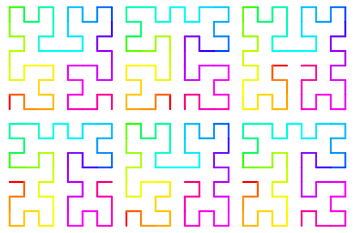

# Hilbert 2D 

[![Latest Version]][crates.io] [![API Documentation]][docs.rs] [![rustc 1.46+]][Rust 1.46]

[Latest Version]: https://img.shields.io/crates/v/hilbert_2d.svg
[crates.io]: https://crates.io/crates/hilbert_2d
[API Documentation]: https://docs.rs/hilbert_2d/badge.svg
[docs.rs]: https://docs.rs/hilbert_2d
[rustc 1.46+]: https://img.shields.io/badge/rustc-1.46+-lightgray.svg
[Rust 1.46]: https://blog.rust-lang.org/2020/08/27/Rust-1.46.0.html

Rust functions for mapping between 1D and 2D space using the Hilbert curve, and its approximations.



## Usage

Add this to your `Cargo.toml`:

```toml
[dependencies]
hilbert_2d = "1.0.0"
```

When working with images and matrices, use the `h2xy_discrete` and `xy2h_discrete` functions:

```rust
use hilbert_2d::{h2xy_discrete, xy2h_discrete, Variant};

let (x, y) = h2xy_discrete(7, 2, Variant::Hilbert); // (1, 2)
let h = xy2h_discrete(2, 1, 2, Variant::Hilbert); // 13
```

When performing real-valued calculations, use the continuous functions instead:

```rust
use hilbert_2d::{h2xy_continuous_f64, Variant};

// Approaches the bottom-left corner
let (x1, y1) = h2xy_continuous_f64(0.0, Variant::Hilbert); 
// Approaches the bottom-right corner
let (x2, y2) = h2xy_continuous_f64(1.0, Variant::Hilbert); 
```

Some of the pattern variants of the Hilbert curve have also been implemented:

```rust
use hilbert_2d::{h2xy_continuous_f64, Variant};

// In the Liu L1 variant, both ends of the curve approach the center of the square
let (x1, y1) = h2xy_continuous_f64(0.0, Variant::Liu1); // (~0.5, ~0.5)
let (x2, y2) = h2xy_continuous_f64(1.0, Variant::Liu1); // (~0.5, ~0.5)
```

## License

Licensed under either of

 * Apache License, Version 2.0
   ([LICENSE-APACHE](LICENSE-APACHE) or http://www.apache.org/licenses/LICENSE-2.0)
 * MIT license
   ([LICENSE-MIT](LICENSE-MIT) or http://opensource.org/licenses/MIT)

at your option.

## Contribution

Unless you explicitly state otherwise, any contribution intentionally submitted
for inclusion in the work by you, as defined in the Apache-2.0 license, shall be
dual licensed as above, without any additional terms or conditions.